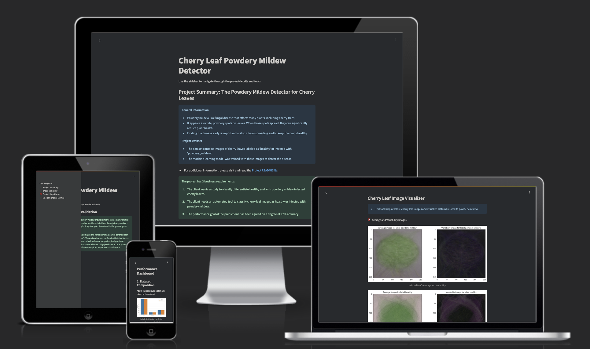
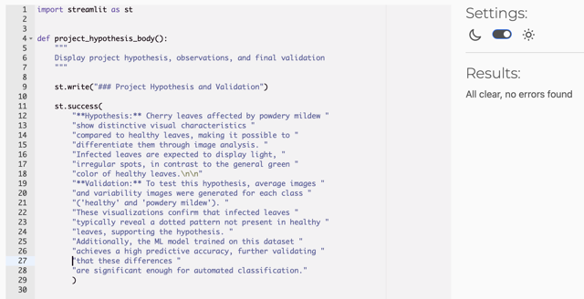

# Mildew Detection in Cherry Leaves

## Project Overview

The Mildew Detection project is a data science and machine learning project developed as part of the "Predictive Analytics" specialization for the Code Institute final portfolio project. The project employs a machine learning model to differentiate between two image categories: healthy cherry leaves and those infected with powdery mildew.

The business context involves a client in the agri-food sector facing challenges with powdery mildew infections on their crops. Currently, disease detection is conducted manually, a process that is both labor-intensive and time-consuming. To enhance efficiency and reliability, this project proposes an ML-based solution that automates the identification of infected leaves from images.
By implementing this model, the client can reduce resource expenditures, streamline disease detection, and ensure a more accurate and timely response to infections.

The project is deployed as a Streamlit app on Render. You can access the live version here: [Cherry Leaf Mildew Detector Model](https://cherryleaf-mildew-detector.onrender.com/).

## Dataset

The dataset used in this project is obtained from Kaggle ([See Kaggle Dataset](https://www.kaggle.com/datasets/codeinstitute/cherry-leaves)). It consists of over 4,000 images collected from the client’s cherry tree plantations. These images belong to two distinct categories:
* **Healthy Leaves**: Cherry leaves with no visible signs of disease
* **Infected Leaves**: Leaves affected by powdery mildew, a fungal infection that appears as a white, powder-like coating on the surface of the leaves

**Dataset Relevance to Business Understanding**

The client is concerned that the outbreak may be impacting crop quality. By analyzing a dataset containing real-world images of healthy and infected leaves, the project ensures the model learns to distinguish between the two categories effectively

The dataset consists of image files categorized into separate directories (/healthy; /powdery_mildew) for supervised machine learning tasks.

Also, the dataset is used for achieving the project objectives, as it provides the necessary visual features to train a Convolutional Neural Network model to classify cherry leaves with high accuracy.

## Business Requirements

The client has outlined three key Business Requirements: 
- 1 - The client is interested in conducting a study to visually differentiate a healthy cherry leaf from one with powdery mildew.
- 2 - The client is interested in predicting if a cherry leaf is healthy or contains powdery mildew.
- 3 - The criteria for the performance goal of the predictions has been agreed on a degree of 97% accuracy.

**Aligning Business Requirements with the Dataset**

The primary objective of this project is to develop a machine learning model capable of detecting powdery mildew in cherry leaves from uploaded photographs. This will replace the current manual inspection process. By automating disease detection, the client aims to reduce operational costs, improve treatment efficiency, and maintain crop quality.

Since the dataset contains a balanced representation of both healthy and diseased leaves, it allows for effective training and testing of a classification model.

 See here above class distribution after splitting the dataset into test, validation and train sets.

Key stakeholders for this project include the agricultural business (Farmy & Foods) and their customers, who rely on high-quality produce.

By using this dataset, the project aligns with the CRISP-DM "Business Understanding" phase, ensuring that the machine learning solution is directly driven by the client’s problem statement and business needs.

## Hypothesis

### Hypothesis: Visual Differentiation Between Healthy and Infected Leaves

The hypothesis is, that cherry leaves affected by powdery mildew show distinct visual characteristics compared to healthy leaves, making it possible to differentiate them through image analysis. For instance, infected leaves are expected to display light, irregular spots, in contrast to the general green color of healthy leaves.

#### Validation

To test the hypothesis, the average image and variability for each class ('healthy' and infected with 'powdery mildew') is generated to highlight dividing patterns.

These visualizations confirm that powdery mildew leaves typically reveal a speckled pattern not present in healthy leaves. The leaf veins are more prominent in infested leaves, and it is possible to see in particular from the variability image of healthy leaves that these usually do not show any striking contrast. The central main part of a healthy leaf is usually a uniform, rich green color and has no contrasting veins. This distinction is therefore supporting the hypothesis. The ML model trained on this dataset also achieves high predictive accuracy (99%), validating that these differences are significant enough for automated classification.

## Rationale to Map Business Requirements to Data Visualisations and ML Tasks

To ensure the machine learning solution aligns with business needs, each business requirement is linked to specific data visualizations and ml tasks.

### User Stories & Mapping

| Business Requirement | User Story | Data Visualisation | ML Task |
|----------------------|------------|--------------------|---------|
| **R1: Visually differentiate a healthy cherry leaf from one with powdery mildew** | As a **data scientist (client)**, I want to **compare healthy and infected leaves visually**, so that I can **understand the features that distinguish a healthy from a diseased leaf**. | Compute and plot the size of the average image, visualize class distributions, plot average and variability of images per label, image montage | Feature extraction (the CNN model learns the features that are specific to healthy and diseased leaves to distinguish them) |
| **R2: Predict if a cherry leaf is healthy or infected** | As a **manager (client)**, I want to **automate disease detection from images**, so that I can **take action to protect crops and save on cost for ressources**. | Image augmentation plots (to ensure the dataset has diverse image data for the model to learn from and prevent overfitting) | Model training, hyperparameter tuning (e.g. adjusting batch size), dropout layers |
| **R3: Ensure high model accuracy (97%)** | As a **business owner (client)**, I want a **highly accurate disease detection model**, so that I can **reduce losses and improve efficiency of the detection process**. | Model evaluation plots (learning curves: accuracy/loss) | Model evaluation on test set, Model evaluation on new random data |

To meet the business requirements effectively, the following steps are necessary:
* The prepared dataset should provide representative images of both healthy and infected leaves, as well as visualizations showing variations within each category (image montage, average image, class distribution plot, average and variability per label plot, image augmentation)
* The model must accurately classify leaves as healthy or infected with powdery mildew (Model validation)
* The system should process images uploaded on the dashboard by the client efficiently
* Predictions should be generated quickly to facilitate real-time decision-making
* The output should be easy to understand for both technical and non-technical users

## ML Business Case

**Business Case for each Machine Learning task:**

1 - _The aim behind the predictive analytics task_

The current process of manual leaf inspection is time-consuming and difficult to scale. It requires specific knowledge and expertise, which causes high costs in human resources and their training. This process is prone to error and inconsistency.

The goal of this machine learning model is to automate the detection of powdery mildew in cherry leaves using image classification. This replaces the current process of manual leaf inspection. By automating the process, the client can reduce the cost of human labour, ressources and improve the efficienty and accuracy of the inspection process. The ml model also makes classification decisions analytically transparent.

2 - _The learning method_

This project uses a Convolutional Neural Network trained from scratch. A convolutional neural networks is ideal for the task of image classification because it automatically learns patterns and details (e.g. edges, textures or shapes) that help the model recognize the difference between healthy and powdery mildew infected leaves.

3 - _The ideal outcome for the process_

The model should achieve at least 97% classification accuracy on test data.

4 - _Success/failure metrics_

4.1 - _Success:_
* Test set accuracy ≥ 97%
* Learning curves show stable exponential curve without overfitting

4.2 - _Failure:_
* Test accuracy below 97%
* Indication to overfitting: Large gap between training and validation learning curve
* Model struggles to differentiate between healthy and powdery mildew infected leaves

5 - _Model output and its relevance for the user_

* The model takes an input image and outputs the predicted class probability for either "healthy" or "infected" with powdery mildew.
* Since the `softmax` activation function is used to create and train the model, the client can see the confidence of the model in predicting whether the cherry leaf is healthy or infected.
* The higher the probability, the more confident the model is in its classification.
* This allows the client in the agricultural industry to quickly assess the health of the cherry leaves on their plantation and make informed decisions about crop protection.

6 - _Heuristics and training data used_

6.1 - **Data Augmentation**

To improve generalization and prevent overfitting, the dataset was augmented using the following transformations:
* Rotation range = 20 degree
  * Help the model recognize leaves from different orientations
* Width and height shift of 10%
  * Simulate variations in image positioning
* 10 % shear and zoom range
  * For perspective distortions and size variations
* Horizontal and vertical flip
  * For different leaf angles
* Fill mode set to ‘nearest’
  * Fill in missing pixels when shifting or rotating images
* Rescale 1:255
  * Normalize pixel values for better model performance

6.2 - **Dataset Splitting**

The dataset was split into three subsets:
* Training Set = 70%
* Validation Set = 10%
* Test Set = 20%

## Dashboard Design

1 - The Project Summary page: This page has important information about the background and origin of the project and the problem it's aiming to solve. Also included on the summary page are the business requirements set in agreement with the customer, which define a successful project, and a link to the README file for further information.

2 - The app page "Image visualizer": Important information for the user is displayed on this page. The customer and ultimately the user of the project site can see in more detail what image data the model is based on. Three checkboxes collapse information and example pictures of the average and variability images, the visual differences between the average images of both classes, and an image montage to show a random sample of image data that the model has been trained and validated on. To obtain the image montage, the user has to select one of the two labels from a dropdown menu and click the button saying 'Create Montage'. Loading can take a short moment. On top of the image montage, the user gets an info message with a brief explanation on how those performed actions help to meet business requirement 1.

The image montage shows a total of 3 colums with 8 rows selecting image data from all the subdirectories of the label selected:

3 - The Project Hypothesis page summarizes the project's hypothesis and it's validation.

4 - ML Performance Metrics page: To meet business requirement 3, the ml performance metrics page showcases what methods have been used to prepare, train, validate and evaluate the model. First, the label frequencies per splitted dataset (train, validation, test image dataset):

Second, the history of model training performance figures:  
[See GitHub Issue about Learning Curves on Accuracy and Loss](https://github.com/nathiedeheyl/pp5_mildew-detection/issues/22)

Third, forth, and lastly - the generalized model loss and accuracy performance metrics as a table and conclusions, as well as conclusions to the business case: 

## Deployment

### Render

- [App live link](https://cherryleaf-mildew-detector.onrender.com)
- Set the runtime.txt Python version to a currently supported version.
- The project was deployed to Render using the following steps:

1. Create a Render account and log in to the dashboard.
2. Click on the "New +" button and select "Web Service".
3. Connect GitHub repository by selecting it from the list or connect GitHub account.
4. Configure the service:
  a - Name: Choose a name for the application
  b - Environment: Select "Python"
  c - Region: Choose the closest region
  d - Branch: Select the branch to deploy
  e - Build Command: pip install -r requirements.txt
  f - Start Command: streamlit run app.py
5. Click "Create Web Service" to initiate the deployment.
6. Render then automatically builds and deploys the application. Once complete, the application can be accessed via the URL provided in the admin panel.

## Main Data Analysis and Machine Learning Libraries

- numpy==1.26.1
- pandas==2.1.1
- matplotlib==3.8.0
- seaborn==0.13.2
- plotly==5.17.0
- Pillow==10.0.1
- streamlit==1.40.2
- joblib==1.4.2
- scikit-learn==1.3.1
- tensorflow==2.19.0
- keras>=3.0.0
- Streamlit - used for dashboard development to present data and for final project delivery
- Render - used to deploy the project as a web app.
- Git/GitHub - used for version control and code storage
- VSCode - IDE used to develop the project
- Am I responsive - used to produce screenshot of the project.

## Testing

### Python Code Validation

| App page | Screenshot before | Fixes | Screenshot validated |
|----------|-------------------|-------|----------------------|
| Project summary |  | fix small syntax errors and apply PEP8 formatting fixes |  |
| page_manager |  | fix small syntax errors and apply PEP8 formatting fixes |  |
| image_visualizer |  | fix small syntax errors and apply PEP8 formatting fixes |  |
| mildew_detector |  | fix small syntax errors and apply PEP8 formatting fixes |  |
| project_hypothesis |  | fix small syntax errors and apply PEP8 formatting fixes |  |
| ml_performance_metrics |  | fix small syntax errors and apply PEP8 formatting fixes |  |
| evaluate_clf |  | PEP8 formatting fix: new line at end of file missing |  |
| predictive_analytics |  | PEP8 formatting fix: new line at end of file missing |  |
| data_management |  | No fixes | - |
| page_manager |  | No fixes | - |
| app.py |  | PEP8 formatting fix: new line at end of file missing |  |

I used Code Institut's PEP8 Python Linter for code validation: https://pep8ci.herokuapp.com/#

### Manual testing

| Feature | Function | Screenshot | Manual Test Validation |
|---------|----------|------------|------------------------|
| Radio button side bar navigation menu | Site navigation: All sites accessible after clicking radio button |  | ✅ |
| Collapsible navigation side menu | Collapsible and responsive side bar navigation |   | ✅ |
| Link to README file | Redirects to README file |  | ✅ |
| Three checkboxes for project image visualization | Collapse the information described | see Dashboard Design above | ✅ |
| Mildew Detector image file upload | Drag and drop or choose and select image files for live prediction |  | ✅ |
| Image live prediction on deployed webpage | Predict class of uploaded image(s) and create downloadable csv file with results in deployed environment | - | ❌ |

Bugs that occured during the work on this project were tracked as issues with the label 'bug', [please see GitHub Issues here](https://github.com/nathiedeheyl/pp5_mildew-detection/issues?q=is%3Aissue%20label%3Abug%20).

#### User Story Testing

Business Requirement 1: Visually differentiate a healthy cherry leaf from one with powdery mildew.

(1) As a client, I can navigate intuitively through the interactive dashboard so that I can view and understand the features that distinguish a healthy from a diseased leaf.

| Feature | Action | Expected Result | Actual Result |
|---------|--------|-----------------|---------------|
| Sidebar Navigation | Click radio buttons in sidebar | Display selected app page | ✅ Page content changes according to selection |
| Responsive Layout | Access dashboard on different devices | Dashboard adjusts to screen size | ✅ Everything resize and reposition appropriately |
| Checkboxes with collapsible info about data and figures | Interact with dashboard elements | Elements collaps and show information requested | ✅ |

(2) As a client/researcher, I can access and visualize sample leaf images so that I can better understand the features of leaves of both classes.

| Feature | Action | Expected Result | Actual Result |
|---------|--------|-----------------|---------------|
| Image Montage | Collapse Image Montage on Image Visualizer page, Select label, click 'Create Montage' button | Display grid of sample images | ✅ Sample images display in organized grid format |

Business Requirement 2: Predicting if a cherry leaf is healthy or contains powdery mildew.

(3) As a client, I want to automate disease detection from images, so that I can take action to protect crops and save on cost for resources.

On locally implemented project:

| Feature | Action | Expected Result | Actual Result |
|---------|--------|-----------------|---------------|
| Mildew Detector Tool | Upload leaf image in local environment | Receive prediction result | ✅ Model correctly identifies label of leaf and returns figures and csv file |
| Batch Processing in Tool | Upload multiple images at once | Process multiple images and return results | ✅ Batch processing of a certian number of images works in local environment |
| Report Generator | Generate downloadable csv report of predictions per image data | Downloads an excel file with detailed information about predictions | ✅ Report is generated, downloadable and contains all data |

Business Requirement 3: Performance goal of the predictions is 97% accuracy minimum.

(4) As a business owner, I want a highly accurate disease detection model, so that I can reduce losses and improve efficiency of the detection process.

| Feature | Action | Expected Result | Actual Result |
|---------|--------|-----------------|---------------|
| Model Metrics Display Page | Showcase model metrics figures to test and evaluate model | View model performance statistics | ✅ Accuracy metrics show a performance of more than 97% |
| Validation Results | Review model validation information | Confirmation of model generalization as numbers are displayed | ✅ Model Generalization table is displayed on dashboard |

(5) As an agricultural specialist, I want detailed classification probabilities rather than binary results, so that I can make more nuanced decisions adapted to given facts.

| Feature | Action | Expected Result | Actual Result |
|---------|--------|-----------------|---------------|
| Softmax activation function | Shows a bar chart with probability distribution per class | Show bar chart | ✅ Probability values displayed per class label |
| Multiclass Visualization | View multiclass prediction results | Show bar chart with class label distribution | ✅ Probability values displayed per class label |

### Image Size Reduction and Model Performance

While resizing images was considered as a possible optimization step, the model performed well at a resolution of 256×256 pixels, and deployment to GitHub was completed successfully without need for adjustments. As a result, resizing was not implemented in this version.

However, for future iterations, investigating the impact of smaller image sizes on model performance and training efficiency could be valuable – particularly if the dataset builds up over time. Optimizing image size may help ensure scalability while maintaining classification accuracy.

## Unfixed Bugs

### Image classification feature unavailable in deployed environment

For more detail see the GitHub issue tracking this bug: [click here](https://github.com/nathiedeheyl/pp5_mildew-detection/issues/20).

**Description of the bug**

The image classification feature implemented to classify healthy cherry leaves and powdery mildew-infected leaves performs well on a local host but seems to be silently crashing in a deployed environment on the cloud platform. Uploading an image in the upload field results in a 502 connection error when calling the function to load the model and predict the class probability.

**Steps taken to troubleshoot this issue**

1. Environment validation: Controlled that the model is  being correctly identified and loaded in the deployed environment.
2. Path Verification: Checked all directory and file paths to ensure they are appropriately specified and leading to the same files within the deployment environment.
3. Error Handling: Added try/except blocks to catch and display any errors during model load and model prediction, but unfortunately to no further clarifying result.
4. Debugging: Added st.write statements throughout the functions to verify the execution to determine the failure point precisely.
5. Dependency Management: Ran various package configurations in requirements.txt, mainly for TensorFlow dependency packages, to address potential compatibility issues.

Despite these efforts, the bug persists in the deployed environment. The 502 connection error suggests a possible resource limitation. The exact underlying cause remains in question as the application behaves differently in the local versus deployed environment. For the current implementation phase, this feature has been removed from the public-facing dashboard.

**Workaround**

The client can still utilize the full functionality of the application by installing and deploying it locally, which aligns with their immediate internal use case. This allows the organization to utilize the image classification feature while a more robust cloud deployment solution is addressed and developed in future iterations. With this internal and local implementation of the project, business requirement 2 is met, by which the client can determine whether a cherry leaf is healthy or infected with powdery mildew by consulting the model's prediction.

This is what the page and feature look like locally deployed:

A comprehensive page with intuitive user interface:

The user can either click the 'Browse files' button or drag and drop their image file onto the uploading field. 

On the dashboard will then be displayed the uploaded image, along with a clear feedback statement on the predicted label of the image uploaded image, as well as a bar chart showcasing the probability of this class prediction by the model:

And finally, an analysis report with a link giving the option to download a report of the analyzed images: 

Clicking this link downloads a CSV file named using the moment's timestamp down to the second to create an individual file name.

**Future Development**

In future development cycles, the following approaches will be considered:

- Optimizing the model size and computational requirements, as well as identifying specific resource constraints.
- More extensive troubleshooting on possibilities to downgrade packages and dependencies without compromising compatibility.
- Exploring alternative deployment platforms.

## Credits

I developed this project with guidance from Code Institute's imaging walkthrough tutorial, which served as a foundational reference throughout the development process and drew from Code Institute's example project ideas. The methodologies and implementation approaches are relying on the educational content provided from this resource, while adapting the concepts to meet the specific requirements.

### Content

- Information about powdery mildew I obtained mainly from the [website of the Royal Horticultural Society](https://www.rhs.org.uk/disease/powdery-mildews)
- Instructions on business case and requirements were taken from Code-Institute's Learn Management System Content Chapter Project Portfolio Project 5 [Handbook: Mildew Detection in Cherry Leaves](https://learn.codeinstitute.net/courses/course-v1:CodeInstitute+PA_PAGPPF+2/courseware/bde016cdbd184cdeafd341a73807e138/bd2104eb84de4e48a9df6f685773cbf2/)

### Media

- The heading image was produced with [ui dev's amiresponsive tool](https://ui.dev/amiresponsive?url=https://cherryleaf-mildew-detector.onrender.com/)

## Acknowledgements

I would like to thank my mentor, Mo Shami, who provided valuable insights and guidance during the project and without whom I could not have accomplished this project. I would also like to thank the Slack community for ongoing support and encouragement.
